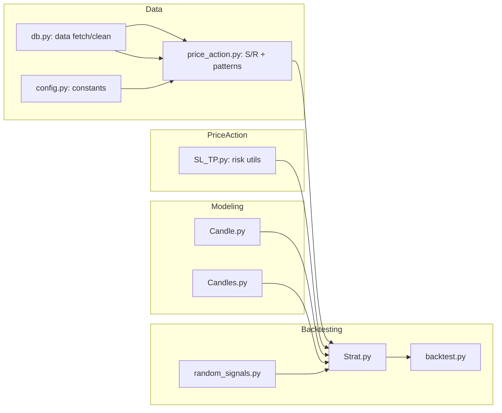

# AutoTrade

> **Modular Python framework for designing and testing rule-driven trading ideas on historical market data.**  
> It includes core systems for price action analysis, support/resistance detection, and candlestick pattern recognition, all wired into a lightweight backtesting engine.  
> Built for flexibility, each component can be modified or swapped without breaking the rest of the pipeline.

### Features
- 📊 **Price Action Engine** – Identify key support/resistance zones  
- 🕯 **Pattern Detection** – Engulfing, star, and other candlestick formations  
- ⚙️ **Risk Management** – Stop-loss & take-profit utilities for backtesting  
- 🧩 **Modular Design** – Swap components without breaking the system  
- ⏳ **Backtesting Integration** – Quickly validate trading ideas on historical data  

---

## 1) General Overview

AutoTrade is a Python-based framework for developing and testing rule-driven trading systems on historical market data. It focuses on modular, readable code so that each trading concept is implemented as a separate, swappable component.

---

### System Additions & Changes

#### Candle and Candles Data Model
**What:** Introduced two core classes:  
- `Candle` — represents a single OHLCV bar with helper methods for body size, wick lengths, and bullish/bearish status.  
- `Candles` — manages collections of `Candle` objects converted from a DataFrame.  

**Change:** Moved away from direct pandas DataFrame manipulation for trading logic, instead wrapping data in an object-oriented interface.  

**Why:** To make logic easier to write, read, and reuse when iterating over historical data.

---

#### Support/Resistance System
**What:** Implemented functions in `price_action.py` to detect key price levels where reversals often occur. Includes proximity checks for when price approaches these levels.  

**Change:** Replaced the initial two-bar pattern logic with a system that calculates and stores S/R levels.  

**Why:** This established the first “core” technical structure system, moving from a simplistic signal toward a foundation for more complex rules.

---

#### Candlestick Pattern Recognition
**What:** Added detection for **engulfing** and **star** patterns in `price_action.py`.  

**Change:** Integrated these patterns alongside the existing S/R detection so they could be used together in strategies.  

**Why:** This was not part of the original plan, but was added after deciding that a working strategy would likely need confirmation beyond S/R levels.

---

#### Risk Management Utilities
**What:** Created `SL_TP.py` containing stop-loss and take-profit calculation helpers.  

**Change:** Integrated these with the backtesting strategy so entries could include defined exits.  

**Why:** These were designed for backtesting scenarios to simulate realistic trade management without implementing live trading logic.

---

#### Backtesting Framework Integration
**What:** Adopted the `backtesting` Python library, implemented a minimal `Strat` class in `Strat.py`, and created `backtest.py` to run it.  

**Change:** Replaced early manual test harnesses with a standard backtesting engine.  

**Why:** To allow consistent measurement of strategy performance and make it easier to plug in different logic modules.

---

#### Random Signal Generator
**What:** Added `random_signals.py` to produce placeholder buy/sell signals.  

**Change:** Connected it to the `Strat` class to verify the backtesting pipeline works end-to-end.  

**Why:** This was used purely for testing the system before integrating real trading logic.

---

## 2) For Developers (Technical)

### Project Architecture (Mermaid diagram)
> High-level module relationships (GitHub renders Mermaid natively).



### Milestone‑based Progress (code achievements, not dates)
- **M1 — Repo bootstrap.** Project skeleton and README scaffold.
- **M2 — First signal logic.** A simple 2‑bar/pattern baseline to generate buy/sell flags.
- **M3 — Pivot to Support/Resistance.** Replace earlier logic with S/R discovery and “approach” checks.
- **M4 — Pattern expansion.** Add **engulfing** and **star** detection; wire **SL/TP** utilities.
- **M5 — Backtesting framework adoption.** Introduce a proper backtesting runner and a minimal Strategy.
- **M6 — Random‑signal scaffolding.** Quick way to validate the harness and plumbing.
- **M7 — Candle data model.** Implement `Candle` and `Candles` for OO‑style reasoning over OHLCV.
- **M8 — Documentation/readability pass.** Heavier comments; clearer `__repr__` and method naming.

### What Changed Where (Module Map)
A developer‑oriented “map” of responsibilities and major changes.

| Module            | Role / Responsibility                                    | Key Additions / Changes |
|-------------------|-----------------------------------------------------------|-------------------------|
| `price_action.py` | Compute **Support/Resistance** zones; detect **patterns** | S/R finding, proximity checks; **engulfing** & **star** detection |
| `SL_TP.py`        | **Risk helpers**                                          | Stop‑loss / take‑profit utilities for strategies |
| `Strat.py`        | **Strategy** definition                                   | Hooks to price action + risk; plugs into backtester |
| `backtest.py`     | **Runner**                                                | Executes a strategy over historical data |
| `random_signals.py`| **Baseline generator**                                   | Simple/random signals to sanity‑check the harness |
| `Candle.py`       | **Single candle** model                                   | OHLCV + helpers (`is_bullish`, `body`, `wicks`) |
| `Candles.py`      | **Collection** of candles                                 | Row→object conversion; iteration; convenience methods |
| `db.py`           | **Data ingestion**                                        | Fetch/clean/prep historical data (source‑specific) |
| `config.py`       | **Configuration**                                         | Constants and tunables (symbols, timeframes, thresholds) |

### Local Development
```bash
git clone https://github.com/danielgermany/AutoTrade
cd AutoTrade
python -m venv .venv && . .venv/Scripts/activate  # Windows
# or: source .venv/bin/activate                    # macOS/Linux
pip install -r requirements.txt  # or install libs you use
python -m pip install -U pip
```

### Contributing
- Keep PRs small and focused on a single concern.
- Add/expand docstrings and inline comments for clarity.
- Where possible, prefer pure functions for testability.
- Include a minimal reproducible example (MRE) for any bug fix.

### Roadmap (suggested next steps)
- Add **session logic** (Asia / London / NY AM / NY PM) tagging to candles.
- Implement **level retest flags** (e.g., prior session high/low hit again).
- Provide a standardized **metrics report** (win rate, PF, DD) after backtests.
- Optional: integrate **ib_insync** to fetch MNQ futures for multi‑year tests.

---

## License
MIT (or project owner’s preferred license).
